<div align="center">

# 📚 School Scheduler

### Web application for creating and managing school timetables

A full-stack web application developed as the Final Degree Project (DAW) that allows educational institutions to create, organize and manage class schedules with drag & drop, teacher availability validation and role-based access.

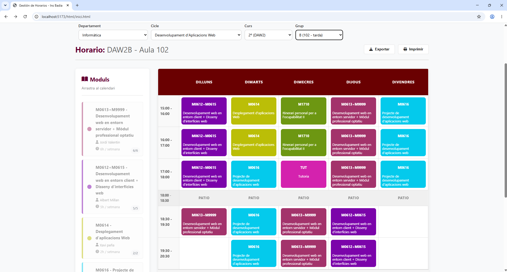


</div>

---

# 📑 Table of Contents

- About
- Features
- Demo
- Screenshots
- Technologies
- Architecture
- Installation
- User Roles
- Project Structure
- Future Improvements
- Authors

---

# 📖 About

School Scheduler is a web application developed to simplify the creation and management of school timetables.

The application allows administrators to:

- Manage departments
- Manage courses
- Manage groups
- Create modules
- Assign teachers
- Configure time slots
- Generate schedules using Drag & Drop
- Prevent timetable conflicts automatically

The project was developed as the Final Degree Project for the Higher Vocational Training in Web Application Development (DAW).

---

# ✨ Features

## Authentication

- JWT Authentication
- Google OAuth Login
- Password encryption (bcrypt)

---

## User Management

- Super Administrator
- Administrator
- Read-only User

---

## Academic Management

- Departments
- Cycles
- Courses
- Groups
- Subjects (Modules)
- Teachers

---

## Timetable Management

- Drag & Drop scheduling
- Teacher availability validation
- Module hour validation
- Automatic conflict detection
- Visual timetable

---

## Image Uploads

- User avatars
- Image compression using Sharp
- Multer upload system

---

# 🎥 Demo

## Drag & Drop

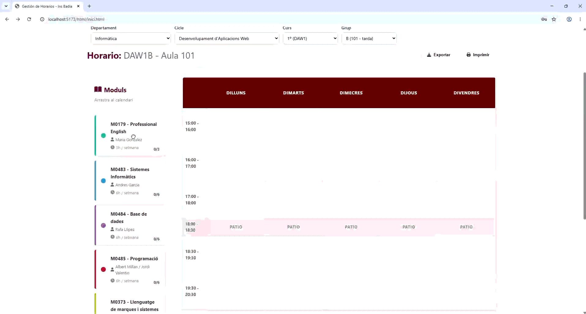

---

## Moving a module


---

## Removing a module

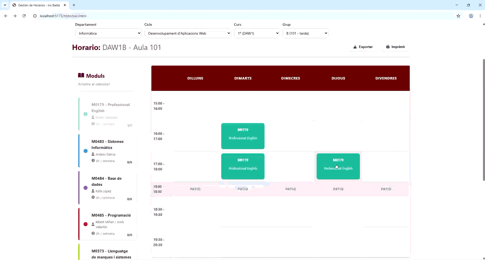

---

## Calendar filters


---

# 🖼️ Screenshots

## Login

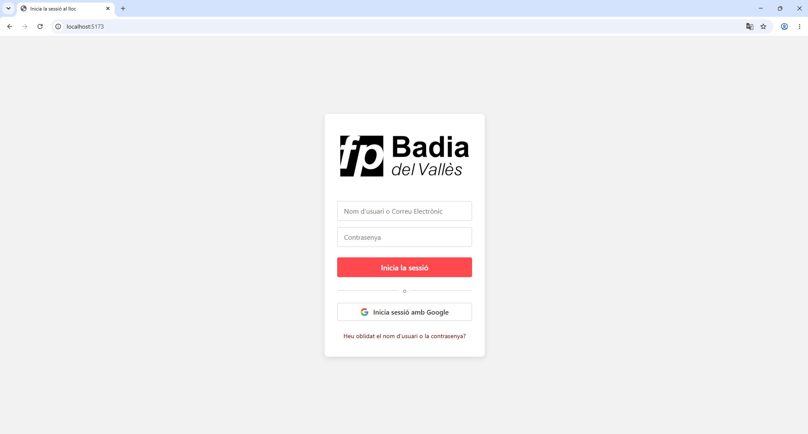

---

## Google Authentication

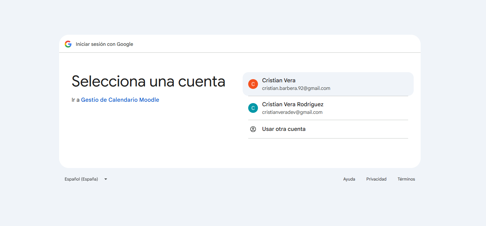

---

## Dashboard

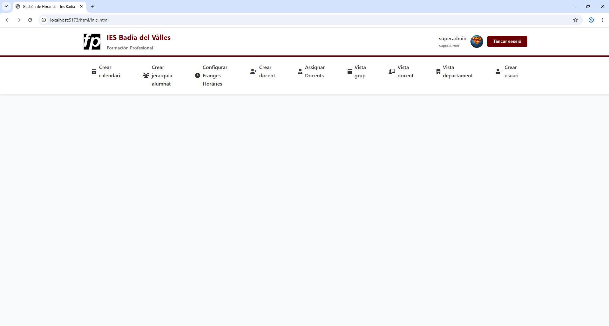

---

## Academic hierarchy

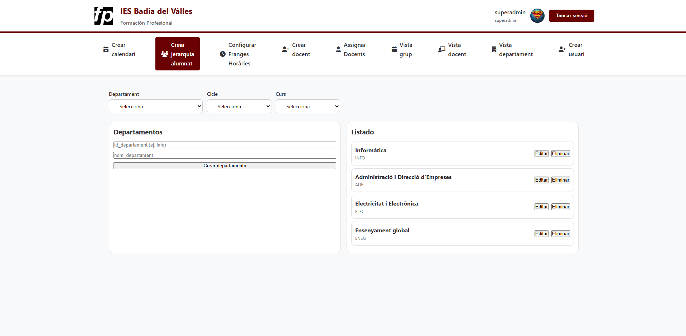

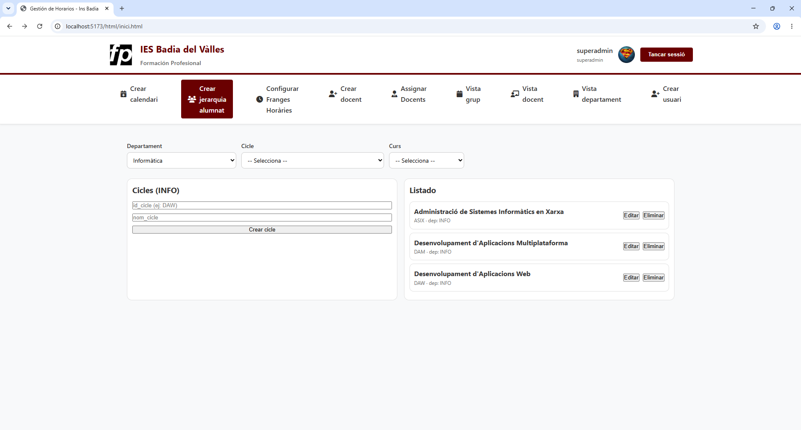

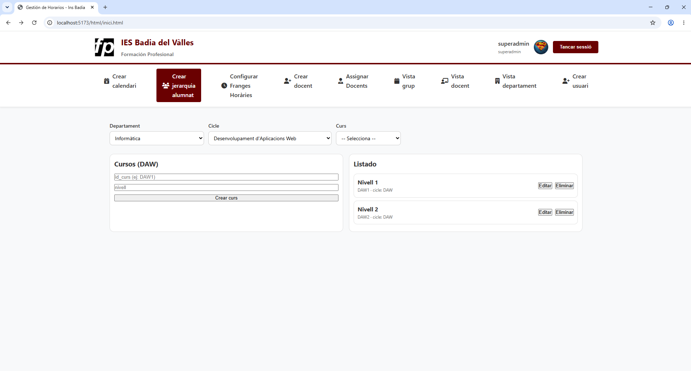

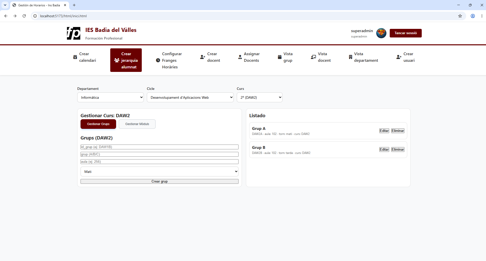

---

## Modules

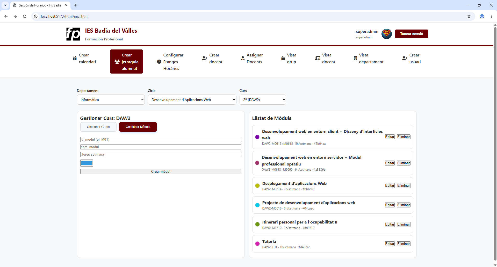

---

## Time Slots

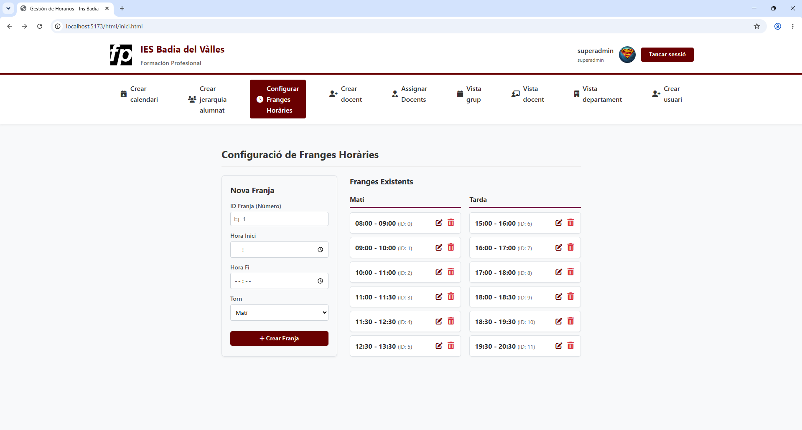

---

## Teachers

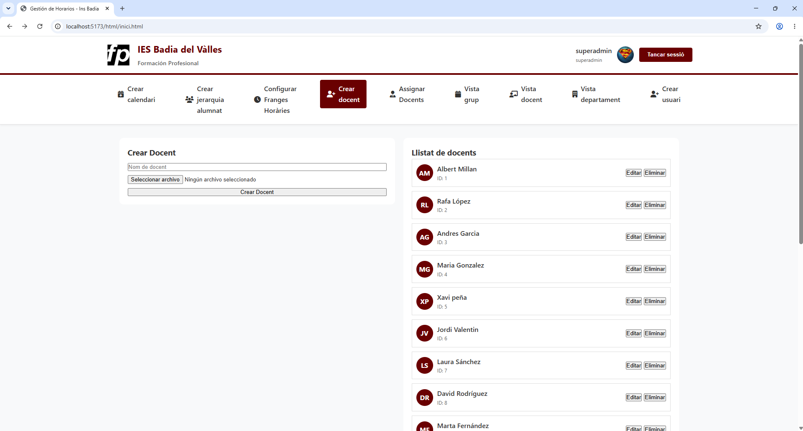

---

## Teacher Assignment

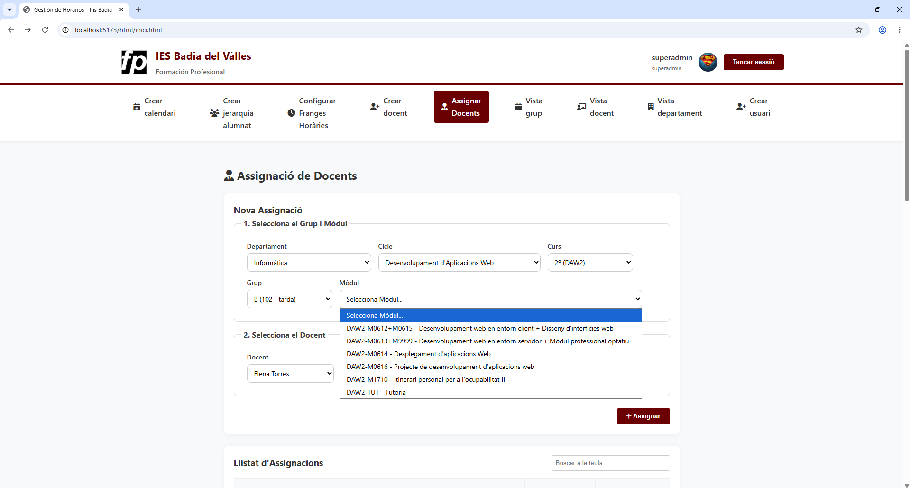

---

## Empty Calendar

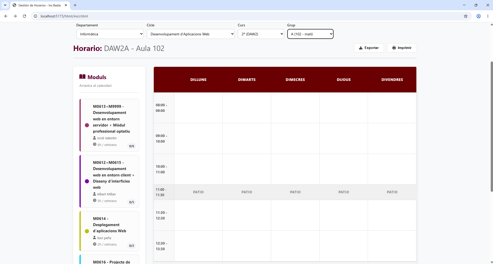

---

## Module Validation

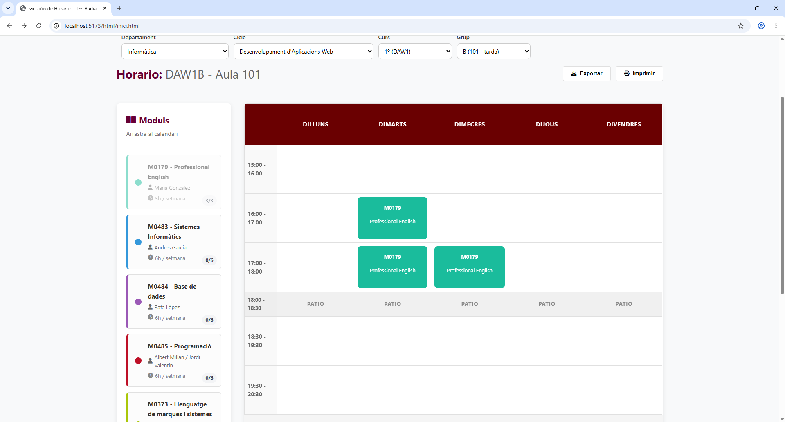

---

## Completed Schedule


---

## Conflict Validation

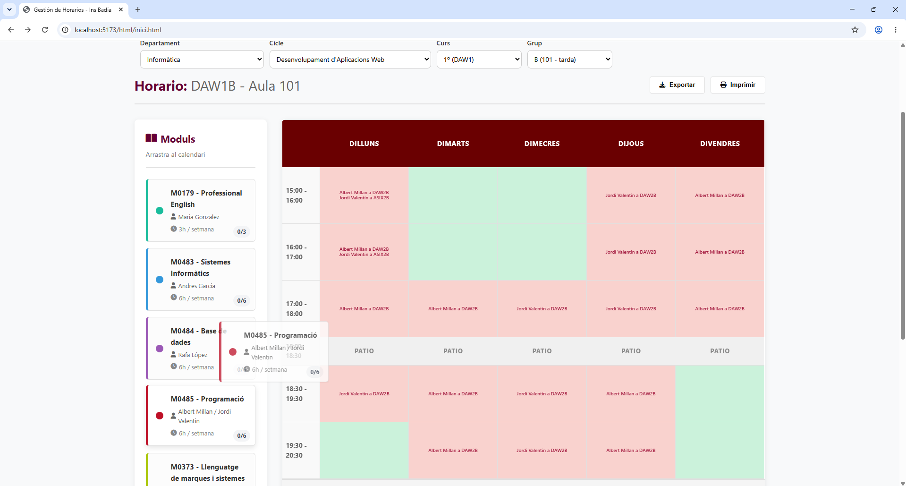

---

## User Management

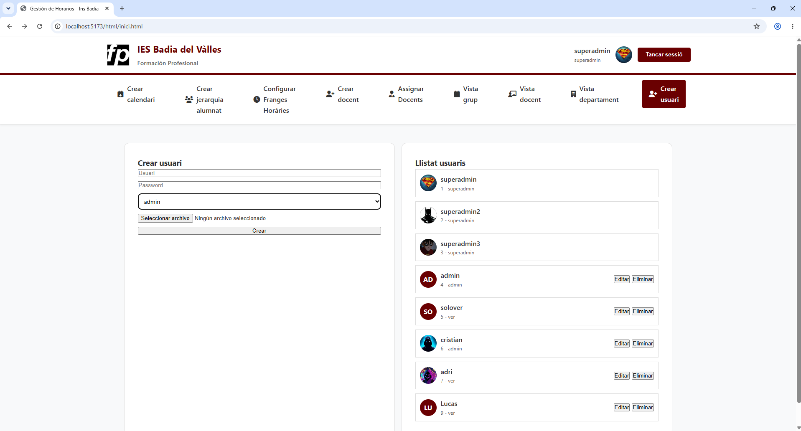

---

# 🛠 Technologies

## Frontend

- HTML5
- CSS3
- TypeScript
- Vite

## Backend

- Node.js
- Express
- TypeScript
- REST API

## Database

- SQLite
- Knex.js
- Objection.js

## Authentication and files

- JWT
- bcryptjs
- Google OAuth

## Image Processing

- Multer
- Sharp

## Tools

- Git
- GitLab
- Jira
- VS Code
- Postman

---

# 🏗 Architecture

```
Frontend (Vite + TypeScript)
        │
 REST API (Express)
        │
 Authentication (JWT)
        │
SQLite Database
        │
Knex + Objection ORM
```

---

# 👥 User Roles

| Role | Permissions |
|------|-------------|
| Super Admin | Full system management |
| Admin | Academic management |
| Read Only | View schedules |

---

# 📂 Project Structure

```text
school-scheduler/
├── backend/
│   ├── app.ts
│   ├── engine/
│   ├── models/
│   ├── routes/
│   ├── types/
│   └── knexfile.ts
│
├── frontend/
│   ├── index.html
│   ├── css/
│   ├── html/
│   ├── img/
│   └── ts/
│
├── assets
│   ├── gifs
│   ├── screenshots
│
└── README.md
```

---

## Main Modules

- **Departments**: manage school departments.
- **Cycles and courses**: organize academic structure.
- **Groups**: assign classrooms and timetable shifts.
- **Teachers**: manage teacher information and avatars.
- **Modules**: define weekly teaching hours and colors.
- **Timetables**: create and validate schedules.
- **Users**: manage access and permissions.

---

# 🚀 Installation

## Clone the repository

```bash
git clone https://github.com/cristianveradev/school-scheduler.git
```

## Install backend

```bash
cd backend
npm install
```

## Install frontend

```bash
cd frontend
npm install
```

## Run backend

```bash
npm run dev
```

## Run frontend

```bash
npm run dev
```

---

# 🚧 Future Improvements

- Export timetable to PDF
- Responsive mobile version
- Dark mode
- Notifications
- Automatic timetable generation
- Statistics dashboard

---

# 👨‍💻 Authors

**Cristian Vera Rodríguez**

Final Degree Project (DAW)

IES Badia del Vallès

2026

- GitHub: [@cristianveradev](https://github.com/cristianveradev)
- LinkedIn: [Cristian Vera Rodríguez](https://www.linkedin.com/in/cristian-vera-rodriguez-13299320b/)
- Email: cristianveradev@gmail.com
